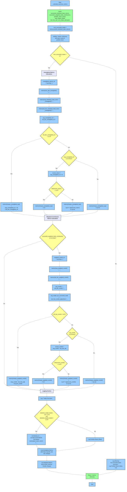

V. `_calculate_summary_metrics`
----

```mermaid
%%{init: {
    'themeVariables': {
        'fontSize': '1em',
        'lineColor': '#bbb',
        'nodePadding': 15
    },
    'flowchart': {
        'htmlLabels': true,
        'curve': 'basis'
    }
} }%%
graph TD
    M1["Start:<br>_calculate_summary_metrics"] -->
    M2["Inputs:<br>successful_individual_trade_returns,<br>successful_weighted_trade_contributions,<br>portfolio_return_actual, total_weight_traded,<br>risk_free_rate, num_trades_attempted"];

    M2 --> M3["num_successful_trades =<br>len(successful_individual_trade_returns)"];
    M3 --> M4["Initialize `metrics` dictionary<br>with basic counts & portfolio return"];

    M4 --> M5{"num_successful_trades > 0?"};

    M5 -- Yes --> M6["<b>Unweighted Metrics<br>Calculation</b>"];
    M6 --> M7["unweighted_returns_arr<br>= np.array(...)"];
    M7 --> M8["metrics['win_rate_unweighted'] = ..."];
    M8 --> M9["metrics['avg_individual_trade_return<br>_unweighted'] = ..."];
    M9 --> M10["metrics['std_dev_individual_trade_return<br>_unweighted'] = ..."];
    M10 --> M11["avg_unweighted_ret = ...<br>std_dev_unweighted_ret = ..."];
    M11 --> M12{"std_dev_unweighted_ret<br>> 1e-9?"};
    M12 -- Yes --> M13["metrics['sharpe_unweighted_avg'] =<br>(avg_unweighted_ret - rfr)<br>/ std_dev_unweighted_ret"];
    M12 -- No --> M14{"avg_unweighted_ret<br>is not None?"};
    M14 -- Yes --> M15["excess_return =<br>avg_unweighted_ret - rfr"];
    M15 --> M16{"abs(excess_return)<br>< 1e-9?"};
    M16 -- Yes --> M17["metrics['sharpe_unweighted_avg']<br>= 0.0"];
    M16 -- No --> M18["metrics['sharpe_unweighted_avg'] =<br>np.inf * sign(excess_return)<br>or np.nan"];
    M14 -- No --> M19["metrics['sharpe_unweighted_avg']<br>= np.nan"];
    M13 --> M20; M17 --> M20; M18 --> M20; M19 --> M20;

    M20["<b>Weighted Contribution<br>Metrics Calculation</b>"];
    M20 --> M21{"successful_weighted_trade_contributions<br>is not empty?"};
    M21 -- Yes --> M22["weighted_contrib_arr<br>= np.array(...)"];
    M22 --> M23["metrics['avg_weighted_contrib'] = ..."];
    M23 --> M24["metrics['std_dev_weighted_contrib'] = ..."];
    M24 --> M25["avg_contrib = ...<br>std_dev_contrib = ..."];
    M25 --> M26["avg_weight_per_successful_trade = ...<br>risk_free_contrib_adjustment = ..."];
    M26 --> M27{"std_dev_contrib > 1e-9?"};
    M27 -- Yes --> M28["metrics['sharpe_weighted_contrib'] =<br>(avg_contrib - risk_free_adj)<br>/ std_dev_contrib"];
    M27 -- No --> M29{"avg_contrib<br>is not None?"};
    M29 -- Yes --> M30["excess_contrib =<br>avg_contrib - risk_free_adj"];
    M30 --> M31{"abs(excess_contrib)<br>< 1e-9?"};
    M31 -- Yes --> M32["metrics['sharpe_weighted_contrib']<br>= 0.0"];
    M31 -- No --> M33["metrics['sharpe_weighted_contrib'] =<br>np.inf * sign(excess_contrib)<br>or np.nan"];
    M29 -- No --> M34["metrics['sharpe_weighted_contrib']<br>= np.nan"];
    M21 -- No --> M35;
    M28 --> M35; M32 --> M35; M33 --> M35; M34 --> M35;

    M35["<b>Logging Section</b>"];
    M35 --> M36["Log: 'Trades Executed...'"];
    M36 --> M37{"abs(total_weight_traded - 1.0) > 1e-6<br>and abs(total_weight_traded) > 1e-9?"};
    M37 -- Yes --> M38["normalized_pr = ...<br>Log Raw & Normalized Port Return<br>metrics['port_return_norm'] = ..."];
    M37 -- No --> M39["Log Portfolio Return (Raw)"];
    M38 --> M40; M39 --> M40;
    M40["Log Unweighted Metrics<br>(Win Rate, Avg Ret, Std Dev, Sharpe)"];
    M40 --> M41["Log Weighted Metrics<br>(Avg Contrib, Std Dev Contrib, Sharpe)"];
    M41 --> M43;

    M5 -- No --> M42["Log Warning:<br>'No successful trades executed...'<br>Log Portfolio Return (likely 0.0)"];
    M42 --> M43;

    M43["Return `metrics`<br>dictionary"] --> M44["End"];

    linkStyle default stroke-width:2px,stroke:#bbb

    classDef decision fill:#ff9,stroke:#333,stroke-width:2px,color:#222;
    classDef process fill:#9cf,stroke:#333,stroke-width:2px,color:#222;
    classDef io fill:#9f9,stroke:#333,stroke-width:2px,color:#222;
    classDef calc fill:#cff,stroke:#333,stroke-width:1px,color:#222;
    classDef section_header fill:#e6e6fa,stroke:#555,stroke-width:2px,color:#222,font-weight:bold;

    class M2,M43 io;
    class M5,M12,M14,M16,M21,M27,M29,M31,M37 decision;
    class M1,M3,M4,M7,M8,M9,M10,M11,M13,M15,M17,M18,M19,M22,M23,M24,M25,M26,M28,M30,M32,M33,M34,M36,M38,M39,M40,M41,M42,M44 process;
    class M6,M20,M35 section_header;
```    