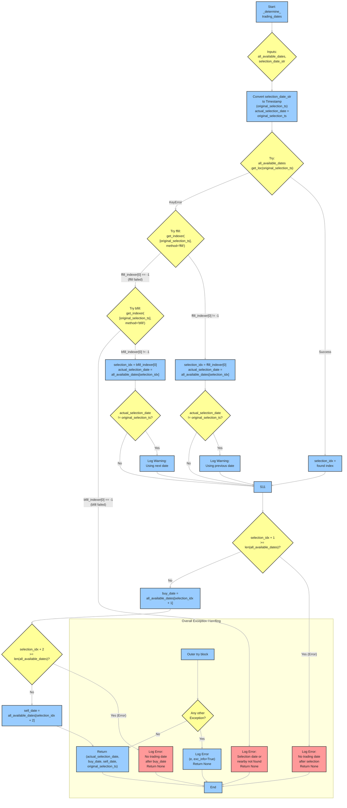

II. `_determine_trading_dates`
----

```mermaid
%%{init: {
    'themeVariables': {
        'fontSize': '1em',
        'lineColor': '#bbb',
        'nodePadding': 15
    },
    'flowchart': {
        'htmlLabels': true,
        'curve': 'basis'
    }
} }%%
graph TD
    S1["Start:<br>_determine_<br>trading_dates"] -->
    S2{"Inputs:<br>all_available_dates,<br>selection_date_str"};
    S2 --> S3["Convert selection_date_str<br>to Timestamp<br>(original_selection_ts)<br>actual_selection_date =<br>original_selection_ts"];
    S3 --> S4{"Try:<br>all_available_dates<br>.get_loc(original_selection_ts)"};
    S4 -- Success --> S5["selection_idx =<br>found index"];
    S4 -- KeyError --> S6{"Try ffill:<br>get_indexer(<br>[original_selection_ts],<br>method='ffill')"};
    S6 -- "ffill_indexer[0] != -1" --> S7["selection_idx = ffill_indexer[0]<br>actual_selection_date =<br>all_available_dates[selection_idx]"];
    S7 --> S7b{"actual_selection_date<br>!= original_selection_ts?"};
    S7b -- Yes --> S7c["Log Warning:<br>Using previous date"];
    S7b -- No --> S11;
    S7c --> S11;
    S6 -- "ffill_indexer[0] == -1<br>(ffill failed)" --> S8{"Try bfill:<br>get_indexer(<br>[original_selection_ts],<br>method='bfill')"};
    S8 -- "bfill_indexer[0] != -1" --> S9["selection_idx = bfill_indexer[0]<br>actual_selection_date =<br>all_available_dates[selection_idx]"];
    S9 --> S9b{"actual_selection_date<br>!= original_selection_ts?"};
    S9b -- Yes --> S9c["Log Warning:<br>Using next date"];
    S9b -- No --> S11;
    S9c --> S11;
    S8 -- "bfill_indexer[0] == -1<br>(bfill failed)" --> S10["Log Error:<br>Selection date or<br>nearby not found<br>Return None"];

    S5 --> S11;
    S11 --> S12{"selection_idx + 1<br>>= len(all_available_dates)?"};
    S12 -- "Yes (Error)" --> S14["Log Error:<br>No trading date<br>after selection<br>Return None"];
    S12 -- No --> S13["buy_date =<br>all_available_dates[selection_idx + 1]"];
    S13 --> S15{"selection_idx + 2<br>>= len(all_available_dates)?"};
    S15 -- "Yes (Error)" --> S17["Log Error:<br>No trading date<br>after buy_date<br>Return None"];
    S15 -- No --> S16["sell_date =<br>all_available_dates[selection_idx + 2]"];
    S16 --> S18["Return (actual_selection_date,<br>buy_date, sell_date,<br>original_selection_ts)"];

    subgraph "Overall Exception Handling"
        direction LR
        E1["Outer try block"] --> E2{Any other<br>Exception?};
        E2 -- Yes --> E3["Log Error<br>(e, exc_info=True)<br>Return None"];
        E2 -- No --> S18; S10; S14; S17; S19;
    end
    E3 --> S19["End"];
    S10 --> S19;
    S14 --> S19;
    S17 --> S19;
    S18 --> S19;

    linkStyle default stroke-width:2px,stroke:#bbb

    classDef decision fill:#ff9,stroke:#333,stroke-width:2px,color:#222;
    classDef process fill:#9cf,stroke:#333,stroke-width:2px,color:#222;
    classDef io fill:#9f9,stroke:#333,stroke-width:2px,color:#222;
    classDef error fill:#f99,stroke:#333,stroke-width:2px,color:#222;

    class S2,S4,S6,S7b,S8,S9b,S12,S15,E2 decision;
    class S1,S3,S5,S7,S7c,S9,S9c,S11,S13,S16,S18,S19,E1,E3 process;
    class S10,S14,S17 error;
```    