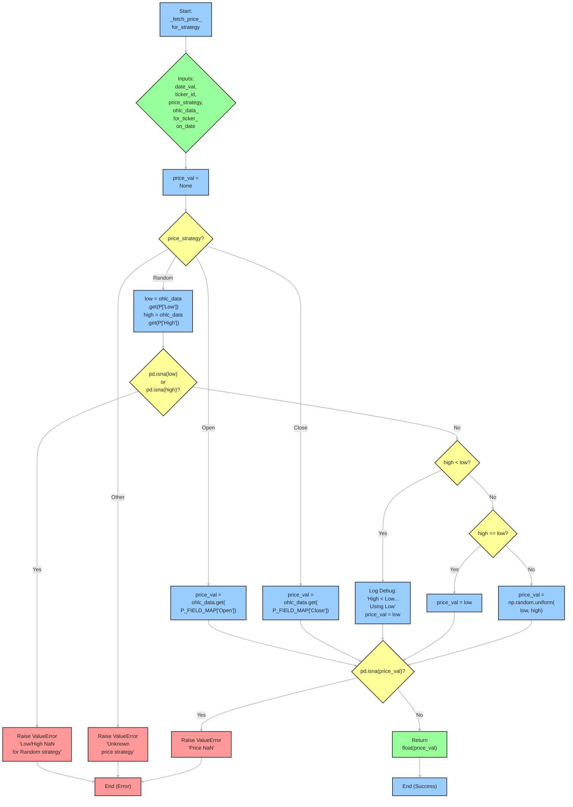

III. `_fetch_price_for_strategy`
----

```mermaid
%%{init: {
    'themeVariables': {
        'fontSize': '1em',
        'lineColor': '#bbb',
        'nodePadding': 15
    },
    'flowchart': {
        'htmlLabels': true,
        'curve': 'basis'
    }
} }%%
graph TD
    F1["Start:<br>_fetch_price_<br>for_strategy"] -->
    F2{"Inputs:<br>date_val,<br>ticker_id,<br>price_strategy,<br>ohlc_data_<br>for_ticker_<br>on_date"};
    F2 --> F2a["price_val =<br>None"];
    F2a --> F3{"price_strategy?"};

    F3 -- "Open" --> F4["price_val =<br>ohlc_data.get(<br>P_FIELD_MAP['Open'])"];
    F3 -- "Close" --> F5["price_val =<br>ohlc_data.get(<br>P_FIELD_MAP['Close'])"];
    F3 -- "Random" --> F6["low = ohlc_data<br>.get(P['Low'])<br>high = ohlc_data<br>.get(P['High'])"];
    F6 --> F7{"pd.isna(low)<br>or<br>pd.isna(high)?"};
    F7 -- Yes --> F8["Raise ValueError<br>'Low/High NaN<br>for Random strategy'"];
    F7 -- No --> F9{"high < low?"};
    F9 -- Yes --> F10["Log Debug:<br>'High < Low...<br>Using Low'<br>price_val = low"];
    F9 -- No --> F11{"high == low?"};
    F11 -- Yes --> F12["price_val = low"];
    F11 -- No --> F13["price_val =<br>np.random.uniform(<br>low, high)"];
    F3 -- "Other" --> F14["Raise ValueError<br>'Unknown<br>price strategy'"];

    F4 --> F15;
    F5 --> F15;
    F10 --> F15;
    F12 --> F15;
    F13 --> F15;

    F15{"pd.isna(price_val)?"};
    F15 -- Yes --> F16["Raise ValueError<br>'Price NaN'"];
    F15 -- No --> F17["Return<br>float(price_val)"];

    F8 --> F18["End (Error)"];
    F14 --> F18;
    F16 --> F18;
    F17 --> F19["End (Success)"];

    linkStyle default stroke-width:2px,stroke:#bbb

    classDef decision fill:#ff9,stroke:#333,stroke-width:2px,color:#222;
    classDef process fill:#9cf,stroke:#333,stroke-width:2px,color:#222;
    classDef io fill:#9f9,stroke:#333,stroke-width:2px,color:#222;
    classDef error fill:#f99,stroke:#333,stroke-width:2px,color:#222;

    class F2,F17 io;
    class F3,F7,F9,F11,F15 decision;
    class F8,F14,F16,F18 error;
    class F1,F2a,F4,F5,F6,F10,F12,F13,F19 process;
```    