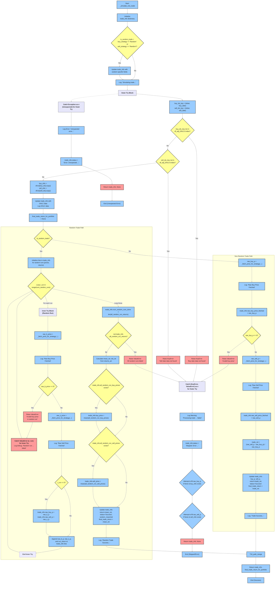

IV. `_simulate_one_trade`
----

```mermaid
%%{init: {
    'themeVariables': {
        'fontSize': '1em',
        'lineColor': '#bbb',
        'nodePadding': 15
    },
    'flowchart': {
        'htmlLabels': true,
        'curve': 'basis'
    }
} }%%
graph TD
    T1["Start:<br>_simulate_one_trade"] --> T2["Initialize<br>trade_info dictionary"];
    T2 --> T3{"is_random_trade = <br>buy_strategy == 'Random' or<br>sell_strategy == 'Random'?"};
    T3 -- Yes --> T4["Update trade_info with<br>random-specific fields"];
    T3 -- No --> T5;
    T4 --> T5;
    T5["Log: 'Simulating trade...'"];

    T5 --> T6["<b>Outer Try Block</b>"];
    T6 --> T7["buy_idx_key = (ticker, buy_date)<br>sell_idx_key = (ticker, sell_date)"];
    T7 --> T8{"buy_idx_key not in<br>df_adj_OHLCV.index?"};
    T8 -- Yes --> T9["Raise KeyError<br>'Buy date data not found'"];
    T8 -- No --> T10{"sell_idx_key not in<br>df_adj_OHLCV.index?"};
    T10 -- Yes --> T11["Raise KeyError<br>'Sell date data not found'"];
    T10 -- No --> T12["buy_ohlc = df.loc[buy_idx].copy()<br>sell_ohlc = df.loc[sell_idx].copy()"];
    T12 --> T13["Update trade_info with<br>OHLC data<br>Log OHLC data"];
    T13 --> T14["final_trade_return_for_portfolio<br>= None"];

    T14 --> T15{"is_random_trade?"};

    subgraph "Random Trade Path"
        direction TB
        T15 -- Yes --> R1["Initialize lists in trade_info<br>for random runs (prices, returns)"];
        R1 --> R2{"Loop i_run in<br>range(num_random_runs)"};
        R2 -- "For each run" --> R3["<b>Inner Try Block<br>(Random Run)</b>"];
        R3 --> R4["raw_b_price =<br>_fetch_price_for_strategy(...)"];
        R4 --> R5["Log: 'Raw Buy Price Fetched'"];
        R5 --> R6{"raw_b_price <= 0?"};
        R6 -- Yes --> R7["Raise ValueError<br>'Invalid buy price<br>in random run'"];
        R6 -- No --> R8["raw_s_price =<br>_fetch_price_for_strategy(...)"];
        R8 --> R9["Log: 'Raw Sell Price Fetched'"];
        R9 --> R10{"i_run == 0?"};
        R10 -- Yes --> R11["trade_info.raw_buy_p = raw_b_p<br>trade_info.raw_sell_p = raw_s_p"];
        R10 -- No --> R12;
        R11 --> R12;
        R12["Append raw_b_p, raw_s_p,<br>and run_return to<br>trade_info lists"];
        R12 --> R13["<b>End Inner Try</b>"];
        R7 --> R14["<b>Catch ValueError (e_run)<br>for Inner Try</b><br>Log Debug: 'Random run ...<br>failed'"];
        R13 --> R2;
        R14 --> R2;
        R2 -- "Loop Done" --> R15_loop_done["trade_info.num_random_runs_done =<br>len(all_random_run_returns)"];
        R15_loop_done --> R16{"not trade_info<br>.all_random_run_returns?"};
        R16 -- Yes --> R17["Raise ValueError<br>'All random runs failed'"];
        R16 -- No --> R18["Calculate mean_ret, std_ret<br>from returns_arr"];
        R18 --> R19{"trade_info.all_random_run_buy_prices<br>exists?"};
        R19 -- Yes --> R20["trade_info.buy_price =<br>mean(all_random_run_buy_prices)"];
        R19 -- No --> R21;
        R20 --> R21;
        R21{"trade_info.all_random_run_sell_prices<br>exists?"};
        R21 -- Yes --> R22["trade_info.sell_price =<br>mean(all_random_run_sell_prices)"];
        R21 -- No --> R23;
        R22 --> R23;
        R23["Update trade_info:<br>return=mean_ret, status='Success',<br>random_mean/std<br>final_trade_return = mean_ret"];
        R23 --> R24["Log: 'Random Trade Success...'"];
    end

    subgraph "Non-Random Trade Path"
        direction TB
        T15 -- No --> NR1["raw_buy_p =<br>_fetch_price_for_strategy(...)"];
        NR1 --> NR2["Log: 'Raw Buy Price Fetched'"];
        NR2 --> NR3["trade_info.raw_buy_price_fetched<br>= raw_buy_p"];
        NR3 --> NR4{"raw_buy_p <= 0?"};
        NR4 -- Yes --> NR5["Raise ValueError<br>'Invalid buy price'"];
        NR4 -- No --> NR6["raw_sell_p =<br>_fetch_price_for_strategy(...)"];
        NR6 --> NR7["Log: 'Raw Sell Price Fetched'"];
        NR7 --> NR8["trade_info.raw_sell_price_fetched<br>= raw_sell_p"];
        NR8 --> NR9["trade_ret =<br>(raw_sell_p - raw_buy_p) / raw_buy_p"];
        NR9 --> NR10["Update trade_info:<br>buy_p, sell_p, return=trade_ret,<br>status='Success'<br>final_trade_return = trade_ret"];
        NR10 --> NR11["Log: 'Trade Success...'"];
    end

    R24 --> T16_path_merge;
    NR11 --> T16_path_merge;
    T16_path_merge --> T16_return["Return trade_info,<br>final_trade_return_for_portfolio"];

    T9 --> T17_catch;  R17 --> T17_catch; NR5 --> T17_catch;
    T11 --> T17_catch;
    T17_catch["<b>Catch (KeyError, ValueError) as e<br>for Outer Try</b>"];
    T17_catch --> T18["Log Warning:<br>'Processing trade ... failed'"];
    T18 --> T19["trade_info.status =<br>'Skipped: Error ...'"];
    T19 --> T20{"Attempt to fill raw_buy_p<br>if None & buy_ohlc exists"};
    T20 --> T21{"Attempt to fill raw_sell_p<br>if None & sell_ohlc exists"};
    T21 --> T22["Return trade_info, None"];

    T6 -.-> T23Fail["<b>Catch Exception as e<br>(Unexpected) for Outer Try</b>"];
    T23Fail --> T23["Log Error: 'Unexpected error...'"];
    T23 --> T24b["trade_info.status =<br>'Error: Unexpected ...'"];
    T24b --> T25["Return trade_info, None"];

    T16_return --> T_End["End (Success)"];
    T22 --> T_End_Error1["End (Skipped/Error)"];
    T25 --> T_End_Error2["End (Unexpected Error)"];


    linkStyle default stroke-width:2px,stroke:#bbb

    classDef decision fill:#ff9,stroke:#333,stroke-width:2px,color:#222;
    classDef process fill:#9cf,stroke:#333,stroke-width:2px,color:#222;
    classDef loop fill:#fcc,stroke:#333,stroke-width:2px,color:#222;
    classDef io fill:#9f9,stroke:#333,stroke-width:2px,color:#222;
    classDef error fill:#f99,stroke:#333,stroke-width:2px,color:#222;
    classDef try_block fill:#e6e6fa,stroke:#333,stroke-width:1px,color:#222;

    class T3,T8,T10,T15,R2,R6,R10,R16,R19,R21,NR4 decision;
    class T1,T2,T4,T5,T7,T12,T13,T14,R1,R4,R5,R8,R9,R11,R12,R15_loop_done,R18,R20,R22,R23,R24,NR1,NR2,NR3,NR6,NR7,NR8,NR9,NR10,NR11,T16_path_merge,T16_return,T18,T19,T20,T21,T23,T24b,T_End,T_End_Error1,T_End_Error2 process;
    class R3,T6,T17_catch,T23Fail try_block;
    class T9,T11,R7,R17,NR5,T22,T25 error;
    class R14 error;
```    