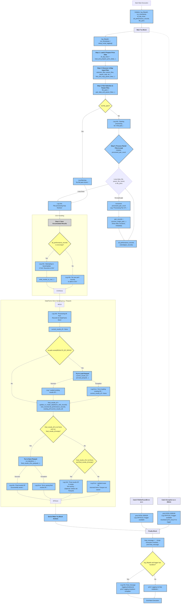

I. `Main`
---

```mermaid
%%{init: {
    'themeVariables': {
        'fontSize': '1em',
        'lineColor': '#bbb',
        'nodePadding': 20  // Increased from 15
    },
    'flowchart': {
        'htmlLabels': true,
        'curve': 'basis',
        'useMaxWidth': false  // Allow nodes to expand beyond max-width
    }
} }%%
graph TD
    ME1["Start Main Execution"] -->
    ME2["Initialize: log_filepath, run_timestamp,<br>df_adj_close, all_performance_records, file_pairs"];

    ME2 --> ME3["<b>Main Try Block</b>"];
    ME3 --> ME4["log_filepath, run_timestamp =<br>setup_script_logging()"];
    ME4 --> ME5["<b>Step 1: Load & Prepare Price Data</b><br>df_adj_close =<br>load_and_prepare_price_data(...)"];
    ME5 --> ME6["<b>Step 2: Discover & Map Input Files</b><br>selection_files, param_files, param_map, etc. =<br>find_and_map_param_files(...)"];
    ME6 --> ME7["<b>Step 3: Pair Selection & Param Files</b><br>file_pairs =<br>pair_data_and_param_files(...)"];    
    ME7 --> ME8{"not file_pairs?"};
    ME8 -- Yes --> ME9["Log Warning:<br>'No file pairs found...'"];
    ME8 -- No --> ME10["Log Info: 'Starting processing<br>for X file pairs...'"];
    ME10 --> ME11{"<b>Step 5: Process Paired Files (Loop)</b><br>Initialize processed_pair_count"};
    ME11 --> ME12{"Loop (data_file, param_file_name)<br>in file_pairs"};
    ME12 -- "For each pair" --> ME13["Increment processed_pair_count<br>Log: 'Processing Pair X/Y...'"];
    ME13 --> ME14["pair_records =<br>process_single_pair(...)<br>(Pass data, functions, metadata)"];
    ME14 --> ME15["all_performance_records<br>.extend(pair_records)"];
    ME15 --> ME12;
    %% Loop back
    ME12 -- "Loop Done" --> ME16["Log Info:<br>'File processing loop finished.'"];
    ME9 --> ME16;
    %% Skip loop path joins here

    ME16 --> ME17["<b>Step 6: Save Accumulated Results</b>"];            

    subgraph "CSV Handling"
        direction TB
        ME17 --> CSV1{"all_performance_records<br>is not empty?"};
        CSV1 -- Yes --> CSV2["Log Info: 'Attempting to Save/Update<br>X Perf. Records to CSV'"];
        CSV2 --> CSV3["write_results_to_csv(...)"];
        CSV1 -- No --> CSV4["Log Info: 'No new perf. records<br>to add to CSV.'"];
        CSV3 --> CSVDone; CSV4 --> CSVDone;
    end
    CSVDone --> ME18;

    subgraph "DataFrame Store Handling (e.g., Parquet)"
        direction TB
        ME18 --> DF1["Log Info: 'Processing All Perf.<br>Records for DataFrame Store'"];
        DF1 --> DF2["current_results_df = None"];
        DF2 --> DF3{"os.path.exists(RESULTS_DF_PATH)?"};
        DF3 -- Yes --> DF4["<b>Try to Load Parquet</b><br>current_results_df =<br>pd.read_parquet(...)"];
        DF4 -- Success --> DF5["Log: 'Loaded existing results DF...'"];
        DF4 -- Exception --> DF6["Log Error: 'Error loading existing DF...'<br>current_results_df = None"];
        DF3 -- No --> DF7;
        DF5 --> DF7;
        DF6 --> DF7;
        DF7["final_results_df =<br>update_or_create_dataframe_with_records(<br>new_records=all_performance_records,<br>existing_df=current_results_df)"];
        DF7 --> DF8{"final_results_df is not None<br>and not final_results_df.empty?"};
        DF8 -- Yes --> DF9["<b>Try to Save Parquet</b><br>os.makedirs(...)<br>final_results_df.to_parquet(...)"];
        DF9 -- Success --> DF10["Log Info: 'Final results DF<br>successfully saved...'"];
        DF9 -- Exception --> DF11["Log Error: 'Error saving final<br>results DF...'"];
        DF8 -- No --> DF12{"final_results_df is not None<br>and final_results_df.empty?"};
        DF12 -- Yes --> DF13["Log Info: 'Final results DF is empty.<br>Not saving...'<br>(Optional: Delete old Parquet)"];
        DF12 -- No --> DF14["Log Error: 'update/create DF<br>returned None. Parquet not saved.'"];
        DF10 --> DFDone; DF11 --> DFDone; DF13 --> DFDone; DF14 --> DFDone;
    end
    DFDone --> ME19_EndOfTry["<b>End of Main Try Block Actions</b>"];

    ME19_EndOfTry --> ME_Finally["<b>Finally Block</b>"]; 
    %% Connect successful try path to finally

    ME3 -.-> ME_FNFE["<b>Catch FileNotFoundError as e</b>"];
    ME_FNFE --> ME_FNFE_Log["print FATAL ERROR<br>Log CRITICAL if logger available"];
    ME_FNFE_Log --> ME_Finally;

    ME3 -.-> ME_Ex["<b>Catch Exception as e (Main)</b>"];
    ME_Ex --> ME_Ex_Log["print FATAL ERROR<br>Log CRITICAL if logger available<br>traceback.print_exc() if no logger"];
    ME_Ex_Log --> ME_Finally;

    ME_Finally --> ME_FinMsg["final_message = '...Script Execution Finished...'<br>print final_message"];
    ME_FinMsg --> ME_FinLog{"log_filepath and logger has handlers?"};
    ME_FinLog -- Yes --> ME_FinLogAction["Log Info: final_message<br>logging.shutdown()<br>print 'Logging shutdown complete.'"];
    ME_FinLog -- No --> ME_FinNoLogAction["print 'Logging not fully initialized...'"];
    ME_FinLogAction --> ME_End["End Main Execution"];
    ME_FinNoLogAction --> ME_End;


    linkStyle default stroke-width:2px,stroke:#bbb

    classDef decision fill:#ff9,stroke:#333,stroke-width:2px,color:#222;
    classDef process fill:#9cf,stroke:#333,stroke-width:2px,color:#222;
    classDef io fill:#9f9,stroke:#333,stroke-width:2px,color:#222;
    classDef error fill:#f99,stroke:#333,stroke-width:2px,color:#222;
    classDef try_block fill:#e6e6fa,stroke:#333,stroke-width:1px,color:#222;
    classDef section_header fill:#d3d3d3,stroke:#555,stroke-width:2px,color:#222,font-weight:bold; %% LightGray for section headers

    class ME2,ME4,ME5,ME6,ME7,ME9,ME10,ME11,ME13,ME14,ME15,ME16,CSV2,CSV3,CSV4,DF1,DF2,DF4,DF5,DF6,DF7,DF9,DF10,DF11,DF13,DF14,ME19_EndOfTry,ME_FNFE_Log,ME_Ex_Log,ME_FinMsg,ME_FinLogAction,ME_FinNoLogAction,ME_End process;
    class ME8,CSV1,DF3,DF8,DF12,ME_FinLog decision;
    class ME3,ME_FNFE,ME_Ex,ME_Finally try_block;
    %% Using try_block for catch and finally as well for visual grouping
    class ME17 section_header; 
    %% For Step 6 header
```    