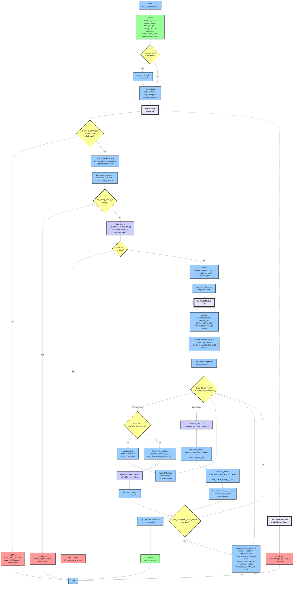

I. `run_single_backtest`

```mermaid
%%{init: {
    'themeVariables': {
        'fontSize': '2em',  %% Your preferred font size
        'lineColor': '#bbb',
        'nodePadding': 15
    },
    'flowchart': {
        'htmlLabels': true,
        'curve': 'basis'
    }
} }%%
graph TD
    RB1["Start:<br>run_single_backtest"] -->
    RB2["Inputs:<br>selection_date, scheme_name,<br>ticker_weights, df_adj_OHLCV,<br>strategies, num_random_runs,<br>seed, risk_free_rate"];

    RB2 --> RB3{"random_seed<br>is not None?"};
    RB3 -- Yes --> RB4["np.random.seed(<br>random_seed)"];
    RB3 -- No --> RB5;
    RB4 --> RB5;
    RB5["Log: 'Initiating<br>Backtest Run...'<br>Log strategies,<br>random runs, seed"];

    RB5 --> RB6["<b>Initial Setup<br>Try Block</b>"];
    RB6 --> RB7{"df_adj_OHLCV.index<br>is MultiIndex<br>with 2 levels?"};
    RB7 -- No --> RB8["Log Error:<br>'df_adj_OHLCV index<br>must be MultiIndex...'<br>Return None"];
    RB7 -- Yes --> RB9["Determine ticker & date<br>index level names/positions<br>Log index name info"];
    RB9 --> RB10["all_trading_dates_ts =<br>Get unique sorted dates<br>from df_adj_OHLCV"];
    RB10 --> RB11{"all_trading_dates_ts<br>.empty?"};
    RB11 -- Yes --> RB12["Log Error:<br>'No trading dates found.'<br>Return None"];
    RB11 -- No --> RB13["date_info =<br>_determine_trading_dates(<br>all_trading_dates_ts,<br>selection_date)"];
    RB13 --> RB14{"date_info<br>is None?"};
    RB14 -- Yes --> RB15["Return None<br>(Error logged in helper)"];
    RB14 -- No --> RB16["Unpack: actual_selection_date,<br>buy_date, sell_date<br>from date_info"];
    RB16 --> RB17["Log Actual Selection,<br>Buy, Sell Dates"];
    RB17 --> RB18["<b>End Initial Setup<br>Try</b>"];

    RB18 --> RB19["Initialize:<br>all_trade_details, returns_lists,<br>portfolio_return_agg,<br>total_weight_traded_agg, counters"];
    RB19 --> RB20["available_tickers_in_df =<br>df_adj_OHLCV.index<br>.get_level_values(ticker_level)<br>.unique()"];
    RB20 --> RB21["Log: 'Processing tickers<br>from input weights...'"];

    RB21 --> RB22{"Loop (ticker, weight)<br>in ticker_weights.items()"};
    RB22 -- "For each ticker" --> RB23{"ticker not in<br>available_tickers_in_df?"};
    RB23 -- Yes --> RB24["Log Warning:<br>'Ticker not found in<br>OHLCV. Skipping.'"];
    RB24 --> RB25["Append 'Skipped'<br>trade detail to<br>all_trade_details"];
    RB25 --> RB22;
    RB23 -- No --> RB26["Increment counters:<br>num_tickers_found_in_data,<br>num_trades_actually_attempted"];
    RB26 --> RB27["trade_info, final_return =<br>_simulate_one_trade(...)"];
    RB27 --> RB28["all_trade_details<br>.append(trade_info)"];
    RB28 --> RB29{"final_unweighted_trade_return<br>is not None?"};
    RB29 -- Yes --> RB30["Append final_return to list<br>weighted_contrib = final_return * W<br>Append weighted_contrib to list<br>portfolio_return_agg += weighted_contrib<br>total_weight_traded_agg += W"];
    RB29 -- No --> RB22;
    RB30 --> RB22;
    RB22 -- "Loop Done" --> RB31;

    RB31["summary_metrics =<br>_calculate_summary_metrics(...)"];
    RB31 --> RB32["summary_metrics<br>['num_selected_tickers_input'] =<br>len(ticker_weights)"];
    RB32 --> RB33["summary_metrics<br>['num_tickers_found_in_df_index'] =<br>num_tickers_found_in_data"];

    RB33 --> RB34["Compile `backtest_results`<br>dictionary (run_inputs,<br>metrics, trades)"];
    RB34 --> RB35["Log: 'Backtest simulation<br>... completed.'"];
    RB35 --> RB36["Return<br>backtest_results"];

    RB6 -.-> RB37Fail["<b>Catch Exception as e<br>(Initial Setup Error)</b>"];
    RB37Fail --> RB37["Log Error:<br>'Error during initial setup...'<br>Return None"];

    RB8 --> RB_End["End"];
    RB12 --> RB_End;
    RB15 --> RB_End;
    RB36 --> RB_End;
    RB37 --> RB_End;

    linkStyle default stroke-width:2px,stroke:#bbb

    classDef decision fill:#ff9,stroke:#333,stroke-width:2px,color:#222;
    classDef process fill:#9cf,stroke:#333,stroke-width:2px,color:#222;
    classDef io fill:#9f9,stroke:#333,stroke-width:2px,color:#222;
    classDef error fill:#f99,stroke:#333,stroke-width:2px,color:#222;
    classDef loop_block fill:#fcc,stroke:#333,stroke-width:2px,color:#222;
    classDef try_block fill:#e6e6fa,stroke:#333,stroke-width:10px,color:#222; %% Your thicker stroke for try_block
    classDef helper_call fill:#ccf,stroke:#333,stroke-width:2px,color:#222;

    class RB2,RB36 io;
    class RB3,RB7,RB11,RB14,RB22,RB23,RB29 decision;
    class RB1,RB4,RB5,RB9,RB10,RB16,RB17,RB19,RB20,RB21,RB24,RB25,RB26,RB28,RB30,RB32,RB33,RB34,RB35,RB_End process;
    class RB13,RB27,RB31 helper_call;
    class RB6,RB18,RB37Fail try_block;
    class RB8,RB12,RB15,RB37 error;
```    