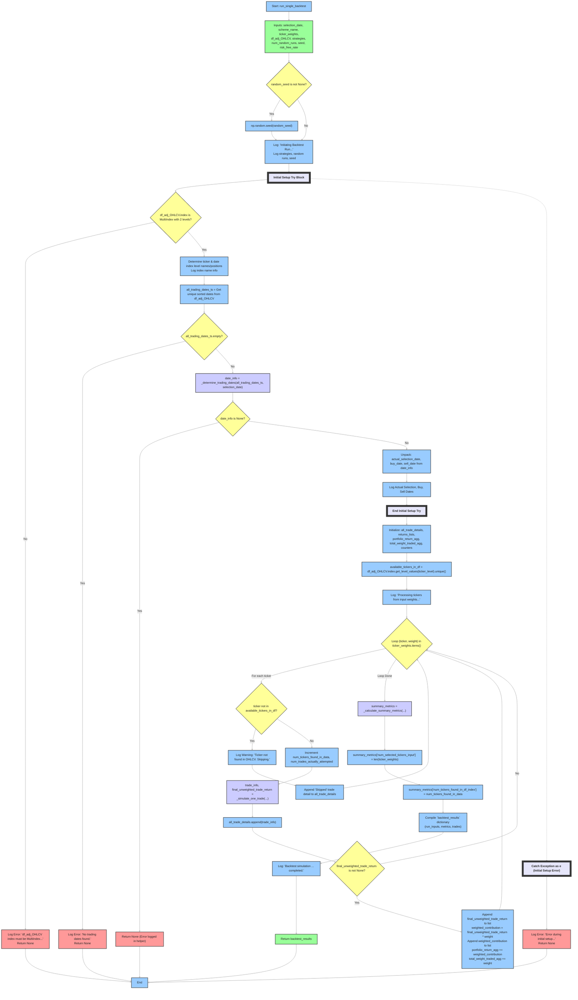
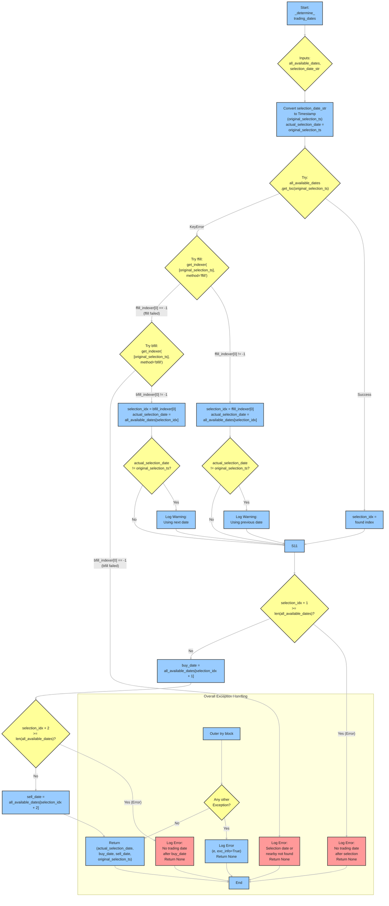
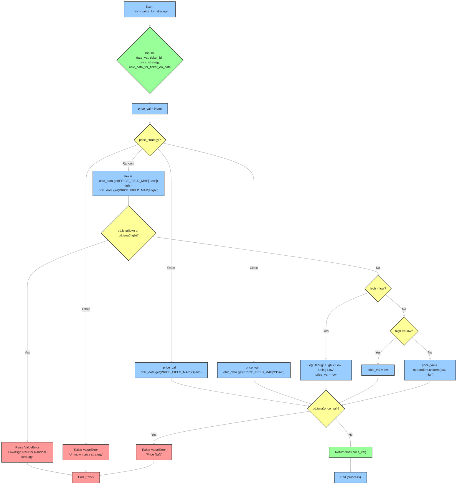

I. `run_single_backtest`
---

```mermaid
%%{init: {
    'themeVariables': {
        'fontSize': '1em',
        'lineColor': '#bbb'
    },
    'flowchart': {
        'htmlLabels': true,
        'curve': 'basis'
    }
} }%%
graph TD
    RB1["Start: run_single_backtest"] -->
    RB2["Inputs: selection_date, scheme_name, ticker_weights,<br>df_adj_OHLCV, strategies, num_random_runs, seed, risk_free_rate"];

    RB2 --> RB3{"random_seed is not None?"};
    RB3 -- Yes --> RB4["np.random.seed(random_seed)"];
    RB3 -- No --> RB5;
    RB4 --> RB5;
    RB5["Log: 'Initiating Backtest Run...'<br>Log strategies, random runs, seed"];

    RB5 --> RB6["<b>Initial Setup Try Block</b>"];
    RB6 --> RB7{"df_adj_OHLCV.index is MultiIndex with 2 levels?"};
    RB7 -- No --> RB8["Log Error: 'df_adj_OHLCV index must be MultiIndex...'<br>Return None"];
    RB7 -- Yes --> RB9["Determine ticker & date index level names/positions<br>Log index name info"];
    RB9 --> RB10["all_trading_dates_ts = Get unique sorted dates from df_adj_OHLCV"];
    RB10 --> RB11{"all_trading_dates_ts.empty?"};
    RB11 -- Yes --> RB12["Log Error: 'No trading dates found.'<br>Return None"];
    RB11 -- No --> RB13["date_info = _determine_trading_dates(all_trading_dates_ts, selection_date)"];
    RB13 --> RB14{"date_info is None?"};
    RB14 -- Yes --> RB15["Return None (Error logged in helper)"];
    RB14 -- No --> RB16["Unpack: actual_selection_date, buy_date, sell_date from date_info"];
    RB16 --> RB17["Log Actual Selection, Buy, Sell Dates"];
    RB17 --> RB18["<b>End Initial Setup Try</b>"];

    RB18 --> RB19["Initialize: all_trade_details, returns_lists,<br>portfolio_return_agg, total_weight_traded_agg, counters"];
    RB19 --> RB20["available_tickers_in_df = df_adj_OHLCV.index.get_level_values(ticker_level).unique()"];
    RB20 --> RB21["Log: 'Processing tickers from input weights...'"];

    RB21 --> RB22{"Loop (ticker, weight) in ticker_weights.items()"};
    RB22 -- For each ticker --> RB23{"ticker not in available_tickers_in_df?"};
    RB23 -- Yes --> RB24["Log Warning: 'Ticker not found in OHLCV. Skipping.'"];
    RB24 --> RB25["Append 'Skipped' trade detail to all_trade_details"];
    RB25 --> RB22;
    RB23 -- No --> RB26["Increment num_tickers_found_in_data, num_trades_actually_attempted"];
    RB26 --> RB27["trade_info, final_unweighted_trade_return =<br>_simulate_one_trade(...)"];
    RB27 --> RB28["all_trade_details.append(trade_info)"];
    RB28 --> RB29{"final_unweighted_trade_return is not None?"};
    RB29 -- Yes --> RB30["Append final_unweighted_trade_return to list<br>weighted_contribution = final_unweighted_trade_return * weight<br>Append weighted_contribution to list<br>portfolio_return_agg += weighted_contribution<br>total_weight_traded_agg += weight"];
    RB29 -- No --> RB22;
    RB30 --> RB22;
    RB22 -- Loop Done --> RB31;

    RB31["summary_metrics = _calculate_summary_metrics(...)"];
    RB31 --> RB32["summary_metrics['num_selected_tickers_input'] = len(ticker_weights)"];
    RB32 --> RB33["summary_metrics['num_tickers_found_in_df_index'] = num_tickers_found_in_data"];

    RB33 --> RB34["Compile `backtest_results` dictionary<br>(run_inputs, metrics, trades)"];
    RB34 --> RB35["Log: 'Backtest simulation ... completed.'"];
    RB35 --> RB36["Return backtest_results"];

    RB6 -.-> RB37Fail["<b>Catch Exception as e (Initial Setup Error)</b>"];
    RB37Fail --> RB37["Log Error: 'Error during initial setup...'<br>Return None"];

    RB8 --> RB_End["End"];
    RB12 --> RB_End;
    RB15 --> RB_End;
    RB36 --> RB_End;
    RB37 --> RB_End;

    linkStyle default stroke-width:2px,stroke:#bbb

    classDef decision fill:#ff9,stroke:#333,stroke-width:2px,color:#222;
    classDef process fill:#9cf,stroke:#333,stroke-width:2px,color:#222;
    classDef io fill:#9f9,stroke:#333,stroke-width:2px,color:#222;
    classDef error fill:#f99,stroke:#333,stroke-width:2px,color:#222;
    classDef loop_block fill:#fcc,stroke:#333,stroke-width:2px,color:#222;
    classDef try_block fill:#e6e6fa,stroke:#333,stroke-width:10px,color:#222;
    classDef helper_call fill:#ccf,stroke:#333,stroke-width:2px,color:#222;

    class RB2,RB36 io;
    class RB3,RB7,RB11,RB14,RB22,RB23,RB29 decision;
    class RB1,RB4,RB5,RB9,RB10,RB16,RB17,RB19,RB20,RB21,RB24,RB25,RB26,RB28,RB30,RB32,RB33,RB34,RB35,RB_End process;
    class RB13,RB27,RB31 helper_call;
    class RB6,RB18,RB37Fail try_block;
    class RB8,RB12,RB15,RB37 error;

```
II. `_determine_trading_dates`
----

```mermaid
%%{init: {
    'themeVariables': {
        'fontSize': '1em',
        'lineColor': '#bbb',
        'nodePadding': 15  %% Increased padding around text in nodes
    },
    'flowchart': {
        'htmlLabels': true,
        'curve': 'basis'
    }
} }%%
graph TD
    S1["Start:<br>_determine_<br>trading_dates"] -->
    S2{"Inputs:<br>all_available_dates,<br>selection_date_str"};
    S2 --> S3["Convert selection_date_str<br>to Timestamp<br>(original_selection_ts)<br>actual_selection_date =<br>original_selection_ts"];
    S3 --> S4{"Try:<br>all_available_dates<br>.get_loc(original_selection_ts)"};
    S4 -- Success --> S5["selection_idx =<br>found index"];
    S4 -- KeyError --> S6{"Try ffill:<br>get_indexer(<br>[original_selection_ts],<br>method='ffill')"};
    S6 -- ffill_indexer[0] != -1 --> S7["selection_idx = ffill_indexer[0]<br>actual_selection_date =<br>all_available_dates[selection_idx]"];
    S7 --> S7b{"actual_selection_date<br>!= original_selection_ts?"};
    S7b -- Yes --> S7c["Log Warning:<br>Using previous date"];
    S7b -- No --> S11;
    S7c --> S11;
    S6 -- "ffill_indexer[0] == -1<br>(ffill failed)" --> S8{"Try bfill:<br>get_indexer(<br>[original_selection_ts],<br>method='bfill')"};
    S8 -- bfill_indexer[0] != -1 --> S9["selection_idx = bfill_indexer[0]<br>actual_selection_date =<br>all_available_dates[selection_idx]"];
    S9 --> S9b{"actual_selection_date<br>!= original_selection_ts?"};
    S9b -- Yes --> S9c["Log Warning:<br>Using next date"];
    S9b -- No --> S11;
    S9c --> S11;
    S8 -- "bfill_indexer[0] == -1<br>(bfill failed)" --> S10["Log Error:<br>Selection date or<br>nearby not found<br>Return None"];

    S5 --> S11;
    S11 --> S12{"selection_idx + 1<br>>= len(all_available_dates)?"};
    S12 -- "Yes (Error)" --> S14["Log Error:<br>No trading date<br>after selection<br>Return None"];
    S12 -- No --> S13["buy_date =<br>all_available_dates[selection_idx + 1]"];
    S13 --> S15{"selection_idx + 2<br>>= len(all_available_dates)?"};
    S15 -- "Yes (Error)" --> S17["Log Error:<br>No trading date<br>after buy_date<br>Return None"];
    S15 -- No --> S16["sell_date =<br>all_available_dates[selection_idx + 2]"];
    S16 --> S18["Return (actual_selection_date,<br>buy_date, sell_date,<br>original_selection_ts)"];

    subgraph "Overall Exception Handling"
        direction LR
        E1["Outer try block"] --> E2{Any other<br>Exception?};
        E2 -- Yes --> E3["Log Error<br>(e, exc_info=True)<br>Return None"];
        E2 -- No --> S18; S10; S14; S17; S19;
    end
    E3 --> S19["End"];
    S10 --> S19;
    S14 --> S19;
    S17 --> S19;
    S18 --> S19;

    linkStyle default stroke-width:2px,stroke:#bbb

    classDef decision fill:#ff9,stroke:#333,stroke-width:2px,color:#222;
    classDef process fill:#9cf,stroke:#333,stroke-width:2px,color:#222;
    classDef io fill:#9f9,stroke:#333,stroke-width:2px,color:#222;
    classDef error fill:#f99,stroke:#333,stroke-width:2px,color:#222;

    class S2,S4,S6,S7b,S8,S9b,S12,S15,E2 decision;
    class S1,S3,S5,S7,S7c,S9,S9c,S11,S13,S16,S18,S19,E1,E3 process;
    class S10,S14,S17 error;
```
III. `_fetch_price_for_strategy`
----

```mermaid
%%{init: {
    'themeVariables': {
        'fontSize': '1em',
        'lineColor': '#bbb'
    },
    'flowchart': {
        'htmlLabels': true,
        'curve': 'basis'
    }
} }%%
graph TD
    F1["Start: _fetch_price_for_strategy"] -->
    F2{"Inputs:<br>date_val, ticker_id, price_strategy,<br>ohlc_data_for_ticker_on_date"};
    F2 --> F2a["price_val = None"];
    F2a --> F3{"price_strategy?"};

    F3 -- "Open" --> F4["price_val = ohlc_data.get(PRICE_FIELD_MAP['Open'])"];
    F3 -- "Close" --> F5["price_val = ohlc_data.get(PRICE_FIELD_MAP['Close'])"];
    F3 -- "Random" --> F6["low = ohlc_data.get(PRICE_FIELD_MAP['Low'])<br>high = ohlc_data.get(PRICE_FIELD_MAP['High'])"];
    F6 --> F7{"pd.isna(low) or pd.isna(high)?"};
    F7 -- Yes --> F8["Raise ValueError<br>'Low/High NaN for Random strategy'"];
    F7 -- No --> F9{"high < low?"};
    F9 -- Yes --> F10["Log Debug: 'High < Low... Using Low'<br>price_val = low"];
    F9 -- No --> F11{"high == low?"};
    F11 -- Yes --> F12["price_val = low"];
    F11 -- No --> F13["price_val = np.random.uniform(low, high)"];
    F3 -- Other --> F14["Raise ValueError<br>'Unknown price strategy'"];

    F4 --> F15;
    F5 --> F15;
    F10 --> F15;
    F12 --> F15;
    F13 --> F15;

    F15{"pd.isna(price_val)?"};
    F15 -- Yes --> F16["Raise ValueError<br>'Price NaN'"];
    F15 -- No --> F17["Return float(price_val)"];

    F8 --> F18["End (Error)"];
    F14 --> F18;
    F16 --> F18;
    F17 --> F19["End (Success)"];

    linkStyle default stroke-width:2px,stroke:#bbb

    classDef decision fill:#ff9,stroke:#333,stroke-width:2px,color:#222;
    classDef process fill:#9cf,stroke:#333,stroke-width:2px,color:#222;
    classDef io fill:#9f9,stroke:#333,stroke-width:2px,color:#222;
    classDef error fill:#f99,stroke:#333,stroke-width:2px,color:#222;

    class F2,F17 io;
    class F3,F7,F9,F11,F15 decision;
    class F8,F14,F16,F18 error;
    class F1,F2a,F4,F5,F6,F10,F12,F13,F19 process;
```
IV. `_simulate_one_trade`
----

```mermaid
%%{init: {
    'themeVariables': {
        'fontSize': '1em',
        'lineColor': '#bbb'
    },
    'flowchart': {
        'htmlLabels': true,
        'curve': 'basis'
    }
} }%%
graph TD
    T1["Start: _simulate_one_trade"] --> T2["Initialize trade_info dictionary"];
    T2 --> T3{"is_random_trade = <br>buy_strategy == 'Random' or sell_strategy == 'Random'?"};
    T3 -- Yes --> T4["Update trade_info with random-specific fields"];
    T3 -- No --> T5;
    T4 --> T5;
    T5["Log: 'Simulating trade...'"];

    T5 --> T6["<b>Outer Try Block</b>"];
    T6 --> T7["buy_idx_key = (ticker, buy_date)<br>sell_idx_key = (ticker, sell_date)"];
    T7 --> T8{"buy_idx_key not in df_adj_OHLCV.index?"};
    T8 -- Yes --> T9["Raise KeyError 'Buy date data not found'"];
    T8 -- No --> T10{"sell_idx_key not in df_adj_OHLCV.index?"};
    T10 -- Yes --> T11["Raise KeyError 'Sell date data not found'"];
    T10 -- No --> T12["buy_ohlc = df_adj_OHLCV.loc[buy_idx_key].copy()<br>sell_ohlc = df_adj_OHLCV.loc[sell_idx_key].copy()"];
    T12 --> T13["Update trade_info with OHLC data<br>Log OHLC data"];
    T13 --> T14["final_trade_return_for_portfolio = None"];

    T14 --> T15{"is_random_trade?"};

    subgraph "Random Trade Path"
        direction TB
        T15 -- Yes --> R1["Initialize lists in trade_info for random runs<br>(prices, returns)"];
        R1 --> R2{"Loop i_run in range(num_random_runs)"};
        R2 -- For each run --> R3["<b>Inner Try Block (Random Run)</b>"];
        R3 --> R4["raw_b_price = _fetch_price_for_strategy(...)"];
        R4 --> R5["Log: 'Raw Buy Price Fetched'"];
        R5 --> R6{"raw_b_price <= 0?"};
        R6 -- Yes --> R7["Raise ValueError 'Invalid buy price in random run'"];
        R6 -- No --> R8["raw_s_price = _fetch_price_for_strategy(...)"];
        R8 --> R9["Log: 'Raw Sell Price Fetched'"];
        R9 --> R10{"i_run == 0?"};
        R10 -- Yes --> R11["trade_info.raw_buy_price_fetched = raw_b_price<br>trade_info.raw_sell_price_fetched = raw_s_price"];
        R10 -- No --> R12;
        R11 --> R12;
        R12["Append raw_b_price, raw_s_price, and run_return to trade_info lists"];
        R12 --> R13["<b>End Inner Try</b>"];
        R7 --> R14["<b>Catch ValueError (e_run) for Inner Try</b><br>Log Debug: 'Random run ... failed'"];
        R13 --> R2;
        R14 --> R2;
        R2 -- Loop Done --> R15["trade_info.num_random_runs_done = len(all_random_run_returns)"];
        R15 --> R16{"not trade_info.all_random_run_returns?"};
        R16 -- Yes --> R17["Raise ValueError 'All random runs failed'"];
        R16 -- No --> R18["Calculate mean_ret, std_ret from returns_arr"];
        R18 --> R19{"trade_info.all_random_run_buy_prices exists?"};
        R19 -- Yes --> R20["trade_info.buy_price = mean(all_random_run_buy_prices)"];
        R19 -- No --> R21;
        R20 --> R21;
        R21{"trade_info.all_random_run_sell_prices exists?"};
        R21 -- Yes --> R22["trade_info.sell_price = mean(all_random_run_sell_prices)"];
        R21 -- No --> R23;
        R22 --> R23;
        R23["Update trade_info: return=mean_ret, status='Success', random_mean/std<br>final_trade_return_for_portfolio = mean_ret"];
        R23 --> R24["Log: 'Random Trade Success...'"];
    end

    subgraph "Non-Random Trade Path"
        direction TB
        T15 -- No --> NR1["raw_buy_p = _fetch_price_for_strategy(...)"];
        NR1 --> NR2["Log: 'Raw Buy Price Fetched'"];
        NR2 --> NR3["trade_info.raw_buy_price_fetched = raw_buy_p"];
        NR3 --> NR4{"raw_buy_p <= 0?"};
        NR4 -- Yes --> NR5["Raise ValueError 'Invalid buy price'"];
        NR4 -- No --> NR6["raw_sell_p = _fetch_price_for_strategy(...)"];
        NR6 --> NR7["Log: 'Raw Sell Price Fetched'"];
        NR7 --> NR8["trade_info.raw_sell_price_fetched = raw_sell_p"];
        NR8 --> NR9["trade_ret = (raw_sell_p - raw_buy_p) / raw_buy_p"];
        NR9 --> NR10["Update trade_info: buy_price, sell_price, return=trade_ret, status='Success'<br>final_trade_return_for_portfolio = trade_ret"];
        NR10 --> NR11["Log: 'Trade Success...'"];
    end

    R24 --> T16;
    NR11 --> T16;
    T16["Return trade_info, final_trade_return_for_portfolio"];

    T9 --> T17;  R17 --> T17; NR5 --> T17;
    T11 --> T17;
    T17["<b>Catch (KeyError, ValueError) as e for Outer Try</b>"];
    T17 --> T18["Log Warning: 'Processing trade ... failed'"];
    T18 --> T19["trade_info.status = 'Skipped: Error ...'"];
    T19 --> T20{"Attempt to fill raw_buy_price_fetched if None and buy_ohlc exists"};
    T20 --> T21{"Attempt to fill raw_sell_price_fetched if None and sell_ohlc exists"};
    T21 --> T22["Return trade_info, None"];

    T6 -.-> T23Fail["<b>Catch Exception as e (Unexpected) for Outer Try</b>"];
    T23Fail --> T23["Log Error: 'Unexpected error...'"];
    T23 --> T24b["trade_info.status = 'Error: Unexpected ...'"];
    T24b --> T25["Return trade_info, None"];

    T16 --> T_End["End (Success)"];
    T22 --> T_End;
    T25 --> T_End;

    linkStyle default stroke-width:2px,stroke:#bbb

    classDef decision fill:#ff9,stroke:#333,stroke-width:2px,color:#222;
    classDef process fill:#9cf,stroke:#333,stroke-width:2px,color:#222;
    classDef loop fill:#fcc,stroke:#333,stroke-width:2px,color:#222;
    classDef io fill:#9f9,stroke:#333,stroke-width:2px,color:#222;
    classDef error fill:#f99,stroke:#333,stroke-width:2px,color:#222;
    classDef try_block fill:#e6e6fa,stroke:#333,stroke-width:1px,color:#222;

    class T3,T8,T10,T15,R2,R6,R10,R16,R19,R21,NR4 decision;
    class T1,T2,T4,T5,T7,T12,T13,T14,R1,R4,R5,R8,R9,R11,R12,R15,R18,R20,R22,R23,R24,NR1,NR2,NR3,NR6,NR7,NR8,NR9,NR10,NR11,T16,T18,T19,T20,T21,T23,T24b,T_End process;
    class R3,T6,T17,T23Fail try_block;
    class T9,T11,R7,R17,NR5,T22,T25 error;
    class R14 error;
```
V. `_calculate_summary_metrics`
----

```mermaid
%%{init: {
    'themeVariables': {
        'fontSize': '1em',
        'lineColor': '#bbb'
    },
    'flowchart': {
        'htmlLabels': true,
        'curve': 'basis'
    }
} }%%
graph TD
    M1["Start: _calculate_summary_metrics"] -->
    M2["Inputs: successful_individual_trade_returns,<br>successful_weighted_trade_contributions,<br>portfolio_return_actual, total_weight_traded,<br>risk_free_rate, num_trades_attempted_on_found_tickers"];

    M2 --> M3["num_successful_trades = len(successful_individual_trade_returns)"];
    M3 --> M4["Initialize `metrics` dictionary with basic counts & portfolio return"];

    M4 --> M5{"num_successful_trades > 0?"};

    M5 -- Yes --> M6["<b>Unweighted Metrics Calculation</b>"];
    M6 --> M7["unweighted_returns_arr = np.array(...)"];
    M7 --> M8["metrics['win_rate_unweighted_trades'] = ..."];
    M8 --> M9["metrics['avg_individual_trade_return_unweighted'] = ..."];
    M9 --> M10["metrics['std_dev_individual_trade_return_unweighted'] = ..."];
    M10 --> M11["avg_unweighted_ret = ...<br>std_dev_unweighted_ret = ..."];
    M11 --> M12{"std_dev_unweighted_ret > 1e-9?"};
    M12 -- Yes --> M13["metrics['sharpe_ratio_unweighted_trades_avg'] = (avg_unweighted_ret - risk_free_rate) / std_dev_unweighted_ret"];
    M12 -- No --> M14{"avg_unweighted_ret is not None?"};
    M14 -- Yes --> M15["excess_return = avg_unweighted_ret - risk_free_rate"];
    M15 --> M16{"abs(excess_return) < 1e-9?"};
    M16 -- Yes --> M17["metrics['sharpe_ratio_unweighted_trades_avg'] = 0.0"];
    M16 -- No --> M18["metrics['sharpe_ratio_unweighted_trades_avg'] = np.inf * sign(excess_return) or np.nan"];
    M14 -- No --> M19["metrics['sharpe_ratio_unweighted_trades_avg'] = np.nan"];
    M13 --> M20; M17 --> M20; M18 --> M20; M19 --> M20;

    M20["<b>Weighted Contribution Metrics Calculation</b>"];
    M20 --> M21{"successful_weighted_trade_contributions is not empty?"};
    M21 -- Yes --> M22["weighted_contrib_arr = np.array(...)"];
    M22 --> M23["metrics['avg_weighted_contribution'] = np.mean(...)"];
    M23 --> M24["metrics['std_dev_weighted_contribution'] = np.std(...)"];
    M24 --> M25["avg_contrib = ...<br>std_dev_contrib = ..."];
    M25 --> M26["avg_weight_per_successful_trade = ...<br>risk_free_contribution_adjustment = ..."];
    M26 --> M27{"std_dev_contrib > 1e-9?"};
    M27 -- Yes --> M28["metrics['sharpe_ratio_weighted_contributions'] = (avg_contrib - risk_free_contribution_adjustment) / std_dev_contrib"];
    M27 -- No --> M29{"avg_contrib is not None?"};
    M29 -- Yes --> M30["excess_contrib = avg_contrib - risk_free_contribution_adjustment"];
    M30 --> M31{"abs(excess_contrib) < 1e-9?"};
    M31 -- Yes --> M32["metrics['sharpe_ratio_weighted_contributions'] = 0.0"];
    M31 -- No --> M33["metrics['sharpe_ratio_weighted_contributions'] = np.inf * sign(excess_contrib) or np.nan"];
    M29 -- No --> M34["metrics['sharpe_ratio_weighted_contributions'] = np.nan"];
    M21 -- No --> M35;
    M28 --> M35; M32 --> M35; M33 --> M35; M34 --> M35;

    M35["<b>Logging Section</b>"];
    M35 --> M36["Log: 'Trades Executed...'"];
    M36 --> M37{"abs(total_weight_traded - 1.0) > 1e-6 and abs(total_weight_traded) > 1e-9?"};
    M37 -- Yes --> M38["normalized_pr = ...<br>Log Raw & Normalized Portfolio Return<br>metrics['portfolio_return_period_normalized'] = ..."];
    M37 -- No --> M39["Log Portfolio Return (Raw)"];
    M38 --> M40; M39 --> M40;
    M40["Log Unweighted Metrics (Win Rate, Avg Ret, Std Dev, Sharpe)"];
    M40 --> M41["Log Weighted Metrics (Avg Contrib, Std Dev Contrib, Sharpe)"];
    M41 --> M43;

    M5 -- No --> M42["Log Warning: 'No successful trades executed...'<br>Log Portfolio Return (likely 0.0)"];
    M42 --> M43;

    M43["Return `metrics` dictionary"] --> M44["End"];

    linkStyle default stroke-width:2px,stroke:#bbb

    classDef decision fill:#ff9,stroke:#333,stroke-width:2px,color:#222;
    classDef process fill:#9cf,stroke:#333,stroke-width:2px,color:#222;
    classDef io fill:#9f9,stroke:#333,stroke-width:2px,color:#222;
    classDef calc fill:#cff,stroke:#333,stroke-width:1px,color:#222;
    classDef section_header fill:#e6e6fa,stroke:#555,stroke-width:2px,color:#222,font-weight:bold;

    class M2,M43 io;
    class M5,M12,M14,M16,M21,M27,M29,M31,M37 decision;
    class M1,M3,M4,M7,M8,M9,M10,M11,M13,M15,M17,M18,M19,M22,M23,M24,M25,M26,M28,M30,M32,M33,M34,M36,M38,M39,M40,M41,M42,M44 process;
    class M6,M20,M35 section_header;
```            